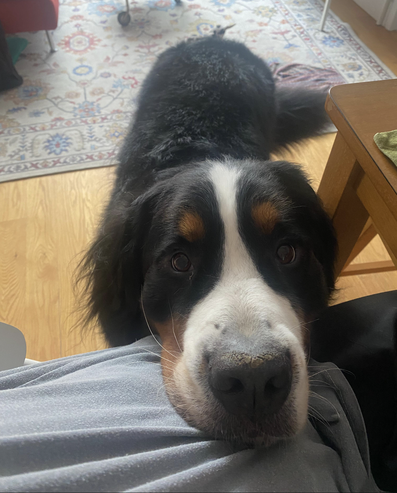

# Retro — Kathy · JuJu · Seren · Gus Mode (IxD ↔ Kathy's Room)

---

## What We built

A two-location system that lets Gus, a dog living at Kathy's apartment, feel present in the IxD classroom. A Viam Rover 2 with a camera sits in Kathy's room; the live feed is segmented and projected onto the classroom wall during lectures, breaks, and group work sessions. Students can trigger a treat dispenser and talk to Gus via mic and speaker using a voice phrase — a low-stakes moment of connection in the middle of a class day.

---

## What worked

Projecting the segmented video feed onto the classroom wall created a surprisingly convincing "presence" effect — Gus on the wall felt less like a screen and more like a window. The voice trigger interaction ("hey buddy!") landed well conceptually; the idea of a special phrase giving students agency over the interaction felt right.

---

## What broke

The Raspberry Pi on the Rover was already configured for Viam's own setup, so it couldn't connect to the IxD WiFi without a full reset — that cost more time than expected and the reset process had to be redone for each testing environment (IxD vs. Kathy's home network). The biggest unresolved question was latency: getting camera footage from the Rover, sending it to the IxD device, running segmentation, and projecting it — we never confirmed which step was the bottleneck or whether any of it was close to real-time. We also didn't know if the Rover's hardware could support an add-on treat dispenser, or whether the Rover even had a mic and speaker built in.

---

## What I'd do differently

Settle the device question (laptop vs. Pi at IxD) and the connection architecture (direct API vs. pre-segmented stream) before touching any hardware. These were open questions the whole semester and they blocked a lot of downstream testing. I'd also prototype the treat dispenser as a totally separate standalone unit first, then figure out Rover integration — trying to do both at once made neither fully work.

---

## Open questions for the next team

- What device runs segmentation at IxD — laptop or Raspberry Pi?
- What's the fastest path for getting video from the Rover to the projector? Direct API stream, or segment on the Rover and send the result?
- What interactions do dogs actually respond to — voice, light, specific frequencies?
- Does the Viam Rover 2 have a built-in mic and speaker?
- Can additional hardware (treat dispenser) be physically attached to the Rover and controlled via software?