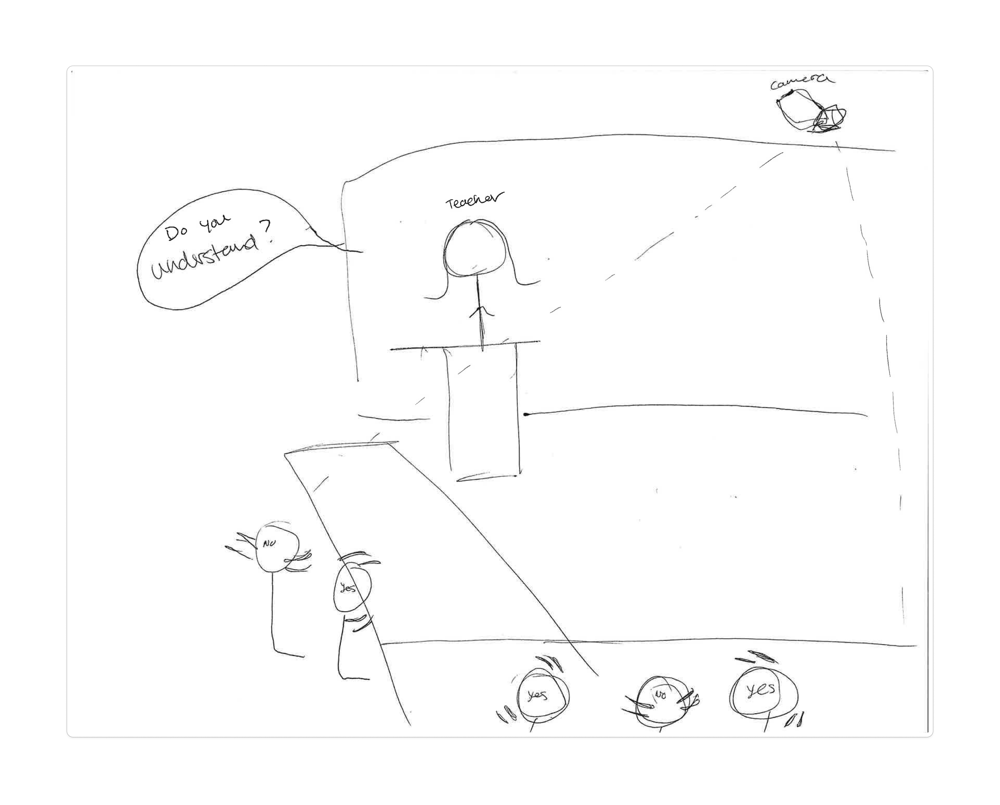

# Project: <your project name>

**Student:** Kathy Choi
**Camera used:** orbit / gravity / horizon (delete the ones you didn't use)
**One-line pitch:** <what your project does, in plain words — no jargon>

---

## What I tried

Two or three sentences. No code. Describe the idea and the approach a non-engineer would understand.

> NodCheck is a tool that helps teachers gauge student understanding through natural head gestures. When a teacher asks "Do you understand?", the system opens a short detection window and uses a webcam to determine whether the student nods (yes) or shakes their head (no).

## What worked

Two or three bullet points. Be specific — "detected a person 3 meters away reliably" is better than "it worked."

- The camera on a the laptop was able to detect a head nod yes or no.
- The nod check displays the number of yes and no nods and accumlates them on the screen.
-

## What broke

Two or three bullet points. **Be honest.** False positives, weird edge cases, things you'd warn the next student about. This is the most valuable section of your retro — don't skip it.

- I still need to create multi-user capabilities and have the total nods be displayed on the intructor's device.
- There is a button to trigger the interaction, but it doesn't currently live any where useful for students and teachers to utilize it.
-

## One screenshot

Put your screenshot in `docs/whitepaper/artifacts/` using the naming convention `<firstname>-<project>-screenshot.png`, then link to it here:

Caption: The drawing is a sketch of the initial idea before building the prototype. The demo is a screenshot of me using the tool.

## If I had another week

If I had another week I would build it out more to be used by multiple students for the instructor to utilize in a real class setting. I would also improve the UI design of the tool.

---

*Submission checklist:*
- [ ] File named `<firstname>-<project>-retro.md` and placed in `docs/whitepaper/retros/`
- [ ] Screenshot added to `docs/whitepaper/artifacts/` and linked above
- [ ] "What broke" section is honest and specific
- [ ] No code snippets — this is a story, not a tutorial
- [ ] Opened as a pull request, not pushed to `main`
