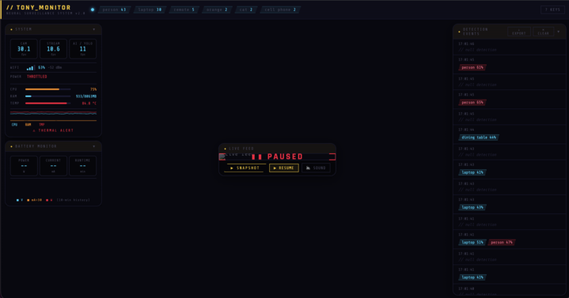

# Project: <Tony>

**Student:** <shuyang>
**Camera used:** orbit / gravity / horizon (delete the ones you didn't use)
**One-line pitch:** <Tony is a classroom agent, that interacst with the class in general to create a more supportive enviroment for both students and educators>

---

## What I tried

Two or three sentences. No code. Describe the idea and the approach a non-engineer would understand.

> Example: I wanted to created a interactive bot that responds back to student moods that seem confused, open to questions or even bored. Tony could have been an app or just pure sofware but that break the experience we want to share with Tony. The point is not to make the user be part of tony but for tony to be part of You!

## What worked

Two or three bullet points. Be specific — "detected a person 3 meters away reliably" is better than "it worked."

- Camara object detection (Yolo)
- Camera life feed and system monitor to check on tony's health
- Emotion foundation model

## What broke

Two or three bullet points. **Be honest.** False positives, weird edge cases, things you'd warn the next student about. This is the most valuable section of your retro — don't skip it.

- The batteries didn't work as we expected, and almost make Tony burn out
- The emotion foundation model isn't really responsive, sometimes it becomes a little bit laggy, and can't differentiate the sad emotion and the confusion mode
-

## One screenshot

Put your screenshot in `docs/whitepaper/artifacts/` using the naming convention `<firstname>-<project>-screenshot.png`, then link to it here:

Caption: Tony's Health.

## If I had another week

If I have another week to do this project, I want to make Tony detect people from miles, and figuring out ways for Tony to detect person's facial experssion in miles.

---

*Submission checklist:*
- [ ] File named `<firstname>-<project>-retro.md` and placed in `docs/whitepaper/retros/`
- [ ] Screenshot added to `docs/whitepaper/artifacts/` and linked above
- [ ] "What broke" section is honest and specific
- [ ] No code snippets — this is a story, not a tutorial
- [ ] Opened as a pull request, not pushed to `main`
