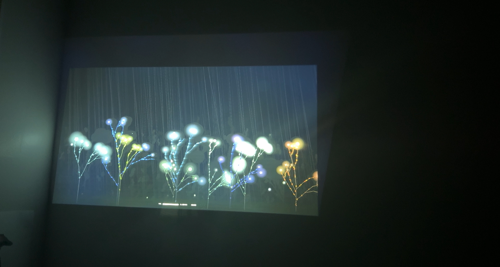

# Vignette: <a short title that captures the moment>

**Student:** <Sophie>
**Project:** <Forest in the classroom>
**Camera used:** <only sound-detection>
**When it happened:** March 23, 2026, ~6–9pm
**Who was in the room:** Sophie

---

## The moment

It's Monday evening, somewhere between 6 and 9pm. I'm alone in the classroom, playing back a recording from earlier that day into forest. On the screen, trees start growing as voices come in. Most of the time it's the teacher talking. Every now and then a student says something. I expected the forest to react differently to each of them, maybe grow faster or slower, or in a different way. But it doesn't really. The forest just grows with whoever is speaking, and only that one plant moves. Then it stops. Then someone else talks, and another plant grows a little.

## Why this moment mattered

Forest doesn't know who is talking. It doesn't care if it's the teacher or a student. The power difference that exists in the room disappears in the forest. I didn't design it to do that on purpose, but watching the recording play out, that's what I noticed.

## One supporting artifact (optional)

Caption: the forest grows by the voice
